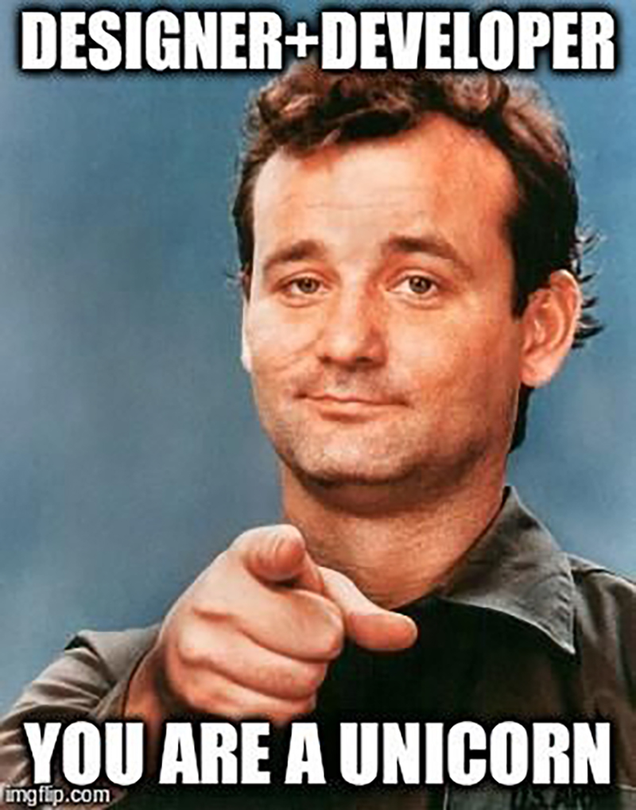
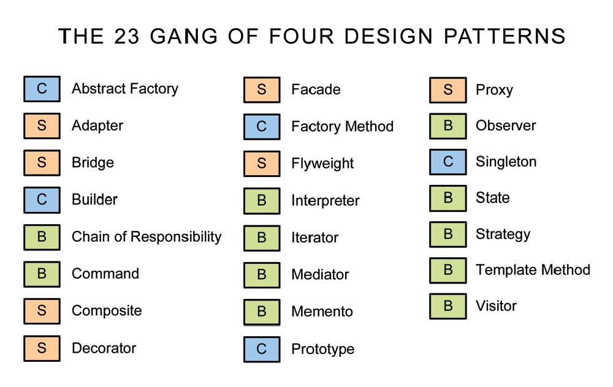

# Software Design Patterns

##### In this post, I will adding the basic information of Software Design Patterns.

 

The Software Design Patterns are mainly divided into three sections based on where it is used. These are the same categories used by **GoF** in their seminal work on design patterns.

- Creational Patterns

* Structural Patterns
* Behavioral Patterns

What is GoF in design patterns?

GoF is actually a commonly used acronym that stand for Gang of Four. The Gang of Four refers to the four authors of the popular book on design patterns called “Design Patterns: Elements of Reusable Object-Oriented Software”. This book is considered to be the bible on design patterns in software engineering. Often, GoF is just used to refer to the book itself, and not the actual authors of the book. Another commonly used acronym is Go4, which means the exact same thing.

Now back to what we were discussing.

#### **Creational Patterns**

Creational design patterns are related to how objects are constructed from classes. The creational design pattern come with powerful suggestions on how best to encapsulate the object creation process in a program.This may sound trivial but littering code with object instance creations can lead to headaches down the road. There are mainly four types of creational patterns.

1. Builder Pattern
2. Prototype Pattern
3. Singleton Pattern
4. Abstract Factory Patterns

#### Structural Patterns

Structural patterns are concerned with the composition of classes like, how the classes are made up or constructed. There are mainly seven types of Structural Patterns.

1. Adapter Pattern
2. Bridge Pattern
3. Composite Pattern
4. Decorator Pattern
5. Facade Pattern
6. Flyweight Pattern
7. Proxy Pattern

#### Behavioural Patterns

Behavioral design patterns dictate the interaction of classes and objects amongst each other and the delegation of responsibility. There are mainly eleven types of Behavioural Patterns.

1. Interpreter Pattern
2. Template Pattern
3. Chain of Responsibility Pattern
4. Command Pattern
5. Iterator Pattern
6. Mediator Pattern
7. Memento Pattern
8. Observer Pattern
9. State Pattern
10. Strategy Pattern
11. Visitor Pattern

Remember this!

