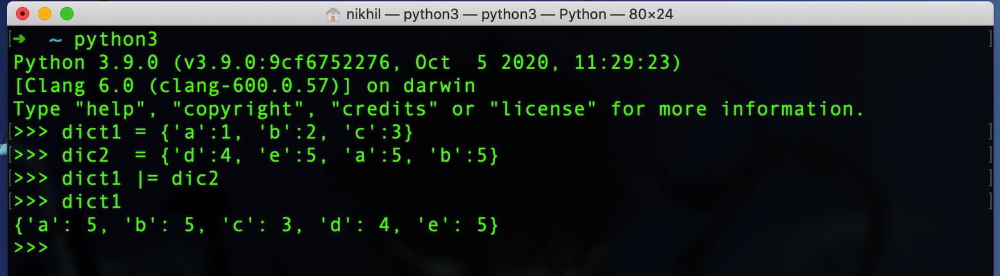
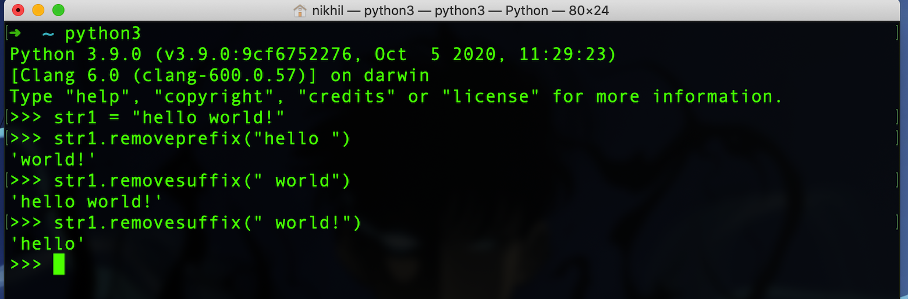

#### What's new in Python 3.9 ??

1. Merging dictionaries

   `There's a new operator "|" that can be used to merge two dictionaries.`

   

2. Updating dictionaries

   `Another new operator "|=" will let you update dictionaries.`

   

3. Removing the prefix and suffix of a string

   `There are two new methods added to the str object to remove the prefix and suffix of the string.`

   

Soon, I will updating this posts with the new parsers and other features of Python 3.9.
