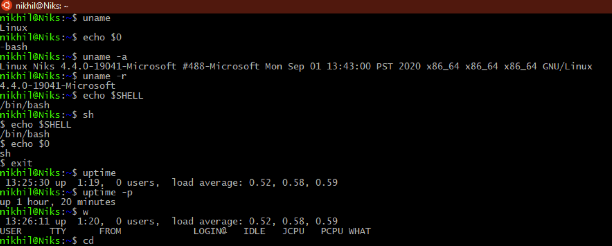
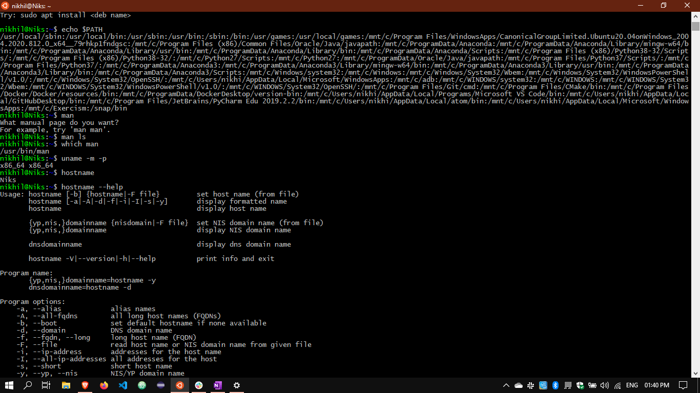
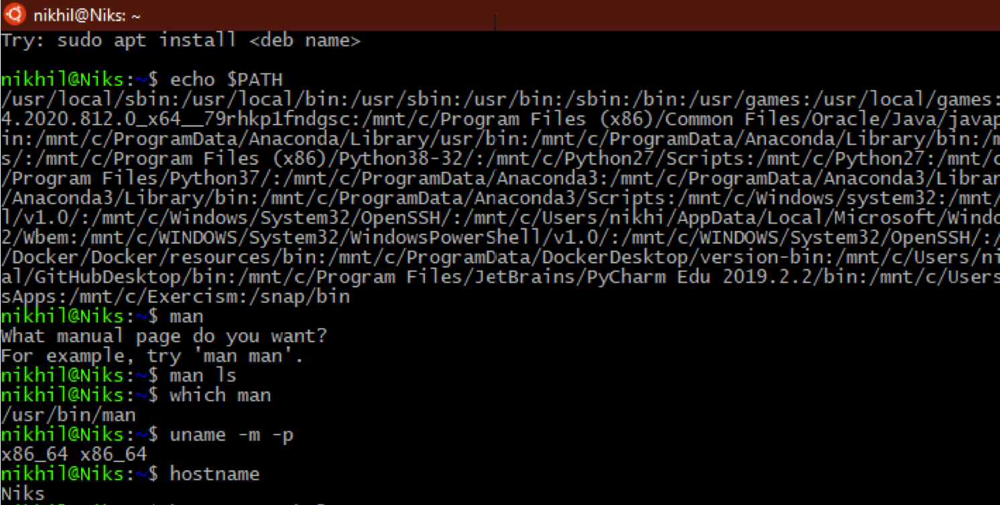

#### The Basic Commands for Linux

`sudo` 

To give the administrators privilege  

`sudo apt-get upgrade`

To update the system

`uname`

For the name of the user logged in

`sh `

To get the shell 

`echo $0`

Gives the name of the shell

`uname-a uname-r`

User names

`echo $PATH`

Displays the path

`w`

The basic information the system, like uptime, load, number of users

`uptime`

Displays the uptime of the system

`uptime -p`

Displays the time alone the uptime

`man`

Manuals of the commands

`hostname -i`

Gives the host ip address

`mkdir`

To create a directory

`rm -r` 

To remove one or more directories

