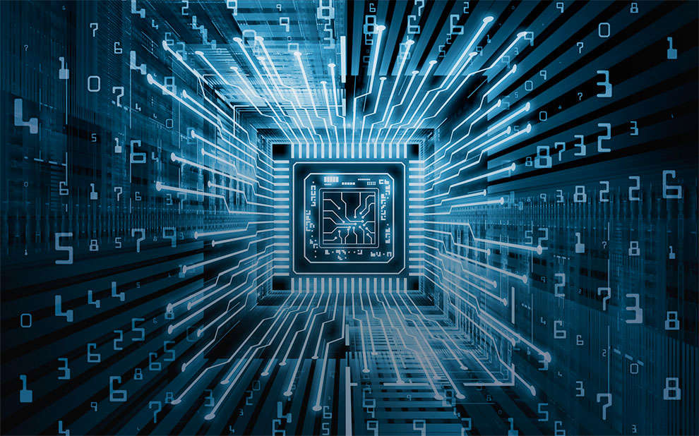

## **What is High Performance Computing?**

This is same as Supercomputers! (But it's wrong....)

But supercomputers are a niche example of High Performance Computers.(ex: Cray Supercomputers).These computers were  equipped with customized features needed to handle complex simulation and calculations making them niche HPC solutions. 

But today, Cray computers have embraced HPC and now offer a **cluster of supercomputers** that embrace interconnected technologies in delivering high-performance computing.

HPCs are interconnected computer systems that use legacy software and are affordable to use. Which indicates that the average HPC system consists of thousands of high-end personal computers dedicated to solving complex problems.

## **How does this "HPC" Function?**

Every computer in an HPC ecosystem is known as a **node**. 

Each node is generally equipped with multiple processors called **compute cores** that handle the computation aspect of problem solving. 

The processors, graphical processing units, and memory of each node are then interconnected by a network for high performance computing.

## But Why "HPC"?

In the early days of **Bitcoin mining**, HPC systems were used to do the job and this played a role in popularizing the concept within the SME crowd. 

HPCs are used in handling **complex simulations**. 

In multi-physics simulations, the simultaneous effect of multiple (natural or artificial) phenomena on a product or structural design is studied. Here, paired partial differentiation and other complex mathematical modelling must be calculated to solve the problem. HPCs can speed up the process.

In industrial design and manufacturing, HPCs have been used to **solve structural and thermal design processes** to optimize production lifecycles.

## Misconceptions Around HPC

Few misconceptions currently making the rounds is :

*Systems can only be used for super complex simulations,*

*Most project managers and CTOs still believe HPCs are too high priced with a low ROI but the facts state otherwise.* 

*The last myth is centered around ease of use.* 

## Where to next?

The HPC space is rapidly expanding and becoming more user-friendly due to the diverse vendors offering integration services. These vendors provide built-in solutions which allow the use of HPCs within existing environments. 

The process of integration can either be through parallel file systems or a cluster management solution. Cloud computing also provides a more affordable avenue for businesses interested in exploring the benefits of HPC services. 

The advantages of HPC cloud-based services include a scalable, on-demand and inexpensive option for handling demanding simulations.

src:(https://www.engineering.com/DesignSoftware/DesignSoftwareArticles/ArticleID/19474/High-Performance-Computing-101-HPC-and-How-Engineers-Can-Use-It.aspx)