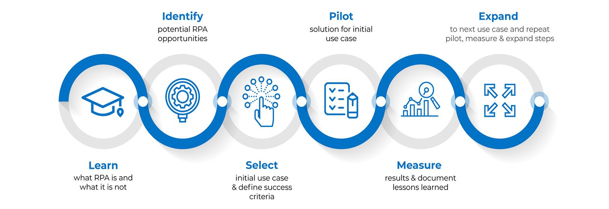
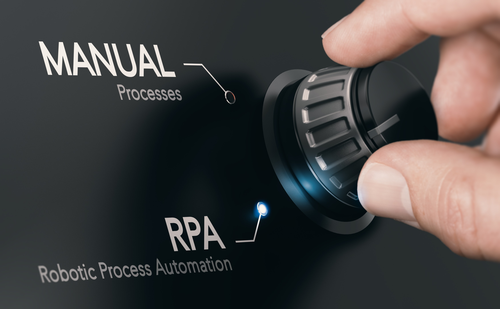

## **What is Robotic Process Automation(RPA)?**

Robotic Process Automation is the technology that allows anyone today to configure computer software, or a “robot” to emulate and integrate the actions of a human interacting within digital systems to execute a business process.It's is software technology that’s easy for anyone to use to automate digital tasks. Robotic Process Automation software bots can interact with any application or system the same way people do—except that RPA bots can operate around the clock, nonstop, much faster and with 100% reliability and precision.RPA robots utilize the user interface to capture data and manipulate applications just like humans do. They interpret, trigger responses and communicate with other systems in order to perform on a vast variety of repetitive tasks. Only substantially better: an RPA software robot never sleeps and makes zero mistakes.RPA scenarios range from something as simple as generating an automatic response to an email to deploying thousands of bots, each programmed to automate jobs in an ERP system.

## HOW DOES ROBOTIC PROCESS AUTOMATION WORK?

Robotic Process Automation bots have the same digital skillset as people—and then some. RPA bots are easy to set up, use, and share. If you know how to record video on your phone, you’ll be able to configure RPA bots. Think of RPA bots as a Digital Workforce that can interact with any system or application.It’s as intuitive as hitting record, play, and stop buttons and using drag-and-drop to move files around at work. RPA bots can be scheduled, cloned, customised, and shared to execute business processes throughout the organisation. For example, bots are able to copy-paste, scrape web data, make calculations.

## WHAT ARE THE BENEFITS OF RPA?

Robotic Process Automation has a positive snowball effect on business operations and outcomes. RPA delivers measurable business benefits right out of the gate—think **cost reduction, greater accuracy, delivery speed**—then continues to add value as it picks up momentum and spreads across the organization. Bots are typically low-cost and easy to implement, requiring no custom software or deep systems integration.RPA improves business outcomes like customer satisfaction and enables competitive advantages by freeing humans to do what they do best—solving problems, improving processes, conducting analysis, and other value-added work—resulting in higher employee engagement and new revenue opportunities.

### Greater Productivity

RPA bots create step-change in employee productivity by accelerating workflows and enabling more work to get done by executing processes independently. In document-intensive industries like financial services, insurance and in the public sector, RPA bots can handle form filling and claims processing all hands-free.

### Better accuracy

Robotic Process Automation software robots are programmed to follow rules. They never get tired and never make mistakes. They are compliant and consistent.

### Increased speed

Employees are the first to appreciate the benefits of RPA as it removes non-value-add activities and relieves them from the rising pressure of work.

### Cost Savings & Fast ROI

The intuitive, code-free interface allows anyone to quickly master bot creation and start driving ROI. For the average employee, that means regaining 40% of their time each day that was wasted on manual digital administrative tasks. In industries like healthcare the value of automating is amplified by the critical importance of error-free, compliant process execution to patient outcomes.

### Integrate Across Platforms

RPA is application agnostic so you’ll never need to upgrade or replace existing systems for RPA to work. Bots enable enterprises to live the dream of eliminating technology siloes by seamlessly connecting across all software tools regardless of function and department, in both front office and back office. The result? Achieve never-before seen enterprise-wide efficiencies and collaboration that taps into the true value of your human capital investment.

### Customer Experiences

In the front office, attended RPA bots help agents interact with customers by doing all the system and data entry legwork—resulting in reduced call handling time (AHT) and a 50% improvement in customer experience at the same time. Industries such as telecommunications and life sciences deploy bots to streamline customer inquiry handling and smoothly respond to spikes in call volumes.

### Harness Artificial Intelligence (AI)

When artificial intelligence (AI) is combined with RPA to create Intelligent Automation, automating extends by an order of magnitude, able to draw on the 80% of enterprise data that’s unstructured. In procure-to-pay, automate invoice processing of non-standard vendor invoices. In insurance, automate extracting claims data and detecting potential fraud. In HR, automate request intake by understanding the employee’s intent.

### Super scalable

Across business units and geographies, RPA performs a massive amount of operations in parallel, from desktop to cloud environments. Additional robots can be deployed quickly with minimal costs, according to work flux and seasonality.

### Improved compliance

Once instructed, RPA robots execute reliably, reducing risk. Everything they do is monitored. You have the full control to operate in accordance with existing regulations and standards.

### Fast cost savings

RPA can reduce processing costs by up to 80%. In less than 12 months, most enterprises already have a positive return on investment, and potential further accumulative cost reductions can reach 20% in time.

