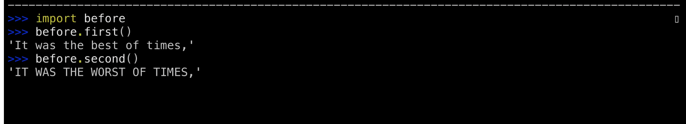

### The New Features of Python 3.9

- Proper Time Zone Support

- Updating Dictionaries with|and|=

- Changes to Decorator Syntax

-  Annotated Type Hints

- PEG Parser

- String Prefix and Suffix

- Type Hint Generics

- Topological Sort v. Greatest Common Divisor and Least Common Multiple

- New HTTP Status Codes

  (Credits : TheRealPython.com)

------

### ***TIME ZONES***

**TIME ZONES PRIOR TO PYTHON 3.9**

By default datetime objects have no time zone information

 You can add a time zone to a date using the tz attribute in date/time creation methods

```python
>>> from datetime import datetime, timezone
>>> datetime.now()
datetime.datetime(2020, 9, 18, 9, 2, 45, 416684)
>>> datetime.now(tz=timezone.utc)
datetime.datetime(2020, 9, 18, 13, 2, 47, 24553, tzinfo=datetime.timezone.utc)
```

Timezone provides one timezone: UTC

You can create your own time zone by subclassing and specifying an offset

 **TIME ZONES IN PYTHON 3.9**

Use zoneinfo.ZoneInfo to access your computer’s time zone database

● Can specify time zones by name

● Has hundreds of time zones

● Handles zone name changes during daylight savings time

```python
>>> from datetime import datetime, timezone
>>> datetime.now()
datetime.datetime(2020, 9, 23, 13, 21, 55, 632239)
>>> datetime.now(tz=timezone.utc)
datetime.datetime(2020, 9, 23, 17, 22, 2, 792297, tzinfo=datetime.timezone.utc)
>>> from zoneinfo import ZoneInfo
>>> ZoneInfo("America/Vancouver")
zoneinfo.ZoneInfo(key='America/Vancouver')
>>> datetime.now(tz=ZoneInfo("Europe/Oslo")) '''Current time in Oslo'''
datetime.datetime(2020, 9, 23, 19, 27, 30, 544399, tzinfo=zoneinfo.ZoneInfo(key='Europe/Oslo'))
>>> release_date = datetime(2020, 10, 5, 3, 9, tzinfo=ZoneInfo("America/Vancouver")) '''This is the time in Vancouver'''
>>> release_date.astimezone(ZoneInfo("Europe/Oslo")) '''Now the time in Vancouver is converted to Oslo timestamp using ZoneInfo'''
datetime.datetime(2020, 10, 5, 12, 9, tzinfo=zoneinfo.ZoneInfo(key='Europe/Oslo'))
>>> len(zoneinfo.available_timezones()) '''Available timezones in the database'''
595
>>> tz_kiritimati = ZoneInfo("Pacific/Kiritimati") '''Cool little code, try figuring it out!'''
>>> nye = datetime(1994, 12, 31, 9, 0, tzinfo=ZoneInfo("UTC"))
>>> nye.astimezone(tz_kiritimati)
datetime.datetime(1994, 12, 30, 23, 0, tzinfo=zoneinfo.ZoneInfo(key='Pacific/Kiritimati'))
>>> from datetime import timedelta
>>> hour = timedelta(hours=1)
>>> (nye + hour).astimezone(tz_kiritimati)
datetime.datetime(1995, 1, 1, 0, 0, tzinfo=zoneinfo.ZoneInfo(key='Pacific/Kiritimati'))
>>> tz_kiritimati.utcoffset(datetime(1994, 12, 30))
datetime.timedelta(days=-1, seconds=50400)
>>> tz_kiritimati.utcoffset(datetime(1994, 12, 30)) / hour
-10.0
>>> tz_kiritimati.utcoffset(datetime(1995, 1, 1)) / hour
14.0
>>> tz = ZoneInfo("America/Vancouver")
>>> tz.tzname(datetime(2020, 10, 5))
'PDT'
>>> tz.tzname(datetime(2020, 12, 5))
'PST'

```

**ZoneInfo** **DATABASE**

ZoneInfo gets its time zone information from an IANA database installed on your computer ● Some computers don’t have one installed -- particularly Windows

```python
>>> from zoneinfo import ZoneInfo
>>> ZoneInfo("America/Vancouver")
Traceback (most recent call last):
File "<stdin>", line 1, in <module>
ZoneInfoNotFoundError: 'No time zone found with key America/Vancouver'

```

 ● A Python maintained copy of the database can be installed

```python
$ python -m pip install tzdata
```

**PYTHON BACKPORTS**

ZoneInfo has been included in the backports package and is available for Python 3.6-3.8

```python
$ python -m pip install backports.zoneinfo
```

Version agnostic library import:

```python
try:
	import zoneinfo
except ImportError:
	from backports import zoneinfo
```

------

### **MERGING AND UPDATING DICTIONARIES**

Python 3.9 introduces two new dictionary operators:

● Create a new dictionary based on the merging of two dictionaries without effecting the originals using the | operator

● Update a dictionary based on another using the |= operator

```python
>>> pycon = {2016: "Portland", 2018: "Cleveland"}
>>> europython = {2017: "Rimini", 2018: "Edinburgh", 2019: "Basel"}
>>> merged = {**pycon, **europython}
>>> pycon
{2016: 'Portland', 2018: 'Cleveland'}
>>> europython
{2017: 'Rimini', 2018: 'Edinburgh', 2019: 'Basel'}
>>> merged
{2016: 'Portland', 2018: 'Edinburgh', 2017: 'Rimini', 2019: 'Basel'}
>>> merged = pycon.copy()
>>> merged
{2016: 'Portland', 2018: 'Cleveland'}
>>> for key, value in europython.items():
...     merged[key] = value
...
>>> merged
{2016: 'Portland', 2018: 'Edinburgh', 2017: 'Rimini', 2019: 'Basel'}
>>> pycon.update(europython)
>>> pycon
{2016: 'Portland', 2018: 'Edinburgh', 2017: 'Rimini', 2019: 'Basel'}
>>> pycon = {2016:"Portland", 2018:"Cleveland"}
>>> merged = pycon.copy().update(europython)
>>> print(merged)
None'''doesn’t work. And the reason that doesn’t work is because the .update() function operates in place—it does not return a dictionary.So pycon.copy() gets run, the result of that dictionary has .update() called upon it, and then .update() returns nothing. So this short form doesn’t work.You can tackle this problem using the recently introduced walrus operator (:=).'''
>>> (merged := pycon.copy()).update(europython)
>>> merged
{2016: 'Portland', 2018: 'Edinburgh', 2017: 'Rimini', 2019: 'Basel'}
>>> pycon | europython '''Python 3.9 has introduced the pipe operator to make cleaner-looking code to solve the same kind of problem.'''
{2016: 'Portland', 2018: 'Edinburgh', 2017: 'Rimini', 2019: 'Basel'}
>>> pycon
{2016: 'Portland', 2018: 'Cleveland'}
>>> pycon |= europython
>>> pycon
{2016: 'Portland', 2018: 'Edinburgh', 2017: 'Rimini', 2019: 'Basel'}
>>> from collections import defaultdict
>>> europe = defaultdict(lambda: "", {"Norway": "Oslo", "Spain": "Madrid"})
>>> africa = defaultdict(lambda: "", {"Egypt": "Cairo", "Zimbabwe": "Harare"})
>>> {**europe, **africa}
{'Norway': 'Oslo', 'Spain': 'Madrid', 'Egypt': 'Cairo', 'Zimbabwe': 'Harare'}
>>> europe | africa
defaultdict(<function <lambda> at 0x7f9df7b2e5e0>, {'Norway': 'Oslo', 'Spain': 'Madrid', 'Egypt': 'Cairo', 'Zimbabwe': 'Harare'})
>>> libraries = {"collections": "Container datatypes", "math": "Math functions"}
>>> libraries |= [("graphlib", "Topological sort tools")]
>>> libraries
{'collections': 'Container datatypes', 'math': 'Math functions', 'graphlib': 'Topological sort tools'}
>>> asia = {"Georgia": "Tbilisi", "Japan": "Tokyo"}
>>> usa = {"Missouri": "Jefferson City", "Georgia": "Atlanta"}
>>> asia | usa
{'Georgia': 'Atlanta', 'Japan': 'Tokyo', 'Missouri': 'Jefferson City'}
>>> usa | asia
{'Missouri': 'Jefferson City', 'Georgia': 'Tbilisi', 'Japan': 'Tokyo'}

```

 **DICTIONARY-LIKE**

New operators have been added to:

● UserDict ● ChainMap ● OrderedDict ● defaultdict ● WeakKeyDictionary ● WeakValueDictionary ● _Environ ● MappingProxyType

But: have not been added to the abstract base classes Mapping and MutableMapping.

**DUNDER** **Methods**

Operators are implemented by the **dunder** methods: ● __or__() ● __ior__() ● See PEP 584 for details: https://www.python.org/dev/peps/pep-0584/

------

### More Flexible Decorators

A decorator is a callable that wraps a function or class

● Typically used to do something before and/or after a function operates, examples:

● Log information on entry and exit of a function

● Ensure a user is logged in before being allowed access to a web page view

● Prior to Python 3.9, decorators had to be a named callable: only the name of a function or class

● Python 3.9 allows decorators to be any callable expression: anything that resolves to a function or a class

```python
# newdecorators.volume.py
import functools

def normal(func):
    return func

def shout(func):
    @functools.wraps(func)
    def shout_decorator(*args, **kwargs):
        return func(*args, **kwargs).upper()

    return shout_decorator

```

```python
# newdecorators.before.py
from volume import normal, shout

@normal
def first():
    return "It was the best of times,"

@shout
def second():
    return "it was the worst of times,"

```




```python

# newdecorators.decorator_exp.py
from volume import normal, shout

DECORATORS = {
    "normal":normal,
    "shout":shout,
}

voice = input("Choose: ")

@DECORATORS[voice]
def third():
    return "In a hole in the ground there lived a hobbit."

```


------

### **ANNOTATIONS** 

Python 3 has syntax for annotations 

● Originally used to provide extra information about a parameter, for example the units of a variable 

```python
def speed(distance: "feet", time: "seconds") -> "miles per hour":
"""Calculate speed as distance over time"""
fps2mph = 3600 / 5280 # Feet per second to miles per hour
return distance / time * fps2mph
```

PEP 484 introduced the use of annotations for type hints 

● Type hints have become the most common use of annotations 

● Python 3.9 introduces the typing.Annotated class allowing you to annotate with both a type hint and meta information 

------

### **PEG PARSER** 

Python originally used an LL(1) parser 

● Reads a single character at a time and doesn’t backtrack 

● One of the simpler types of parsers 

● Straight forward to implement 

● There are some corner cases 

● Python 3.9 has added a Parsing Expression Grammar (PEG) parser 

● Avoids some of the corner cases 

● Both parsers are available and for Python 3.9 should produce the same Abstract Syntax Tree (AST) 

**OLD PARSER** 

The LL(1) parser can be used through the -X oldparser command line flag 

```python
$ python -X oldparser script_name.py
```

Old parser will be removed in Python 3.10 

● Opens up the grammar to introduce new features, like **PEP 622 Structural Pattern Matching** 

------

### **GENERIC TYPE HINTS** 

Type hints for basic types could be annotated directly using keywords like: str, int, and bool 

● Type hints for generics like lists used to require a special type typing.List

● Python 3.9 removes this need, you can now use list 

**OLD vs NEW HINT LISTS** 

Before Python 3.9 

```python
from typing import List
radius: float = 3.9
radii: List[float] = [3.9, 2.4]
```

Python 3.9: 

```python
radius: float = 3.9
radii: list[float] = [3.9, 2.4]		
```

**REACH INTO THE** **__future__** 

Delayed evaluation of type annotations is available in __future__ 

● Using __future__ you take advantage of the new syntax in Python 3.7 & 3.8 

```python
from __future__ import annotations
radius: float = 3.9
radii: list[float] = [3.9, 2.4]
```

