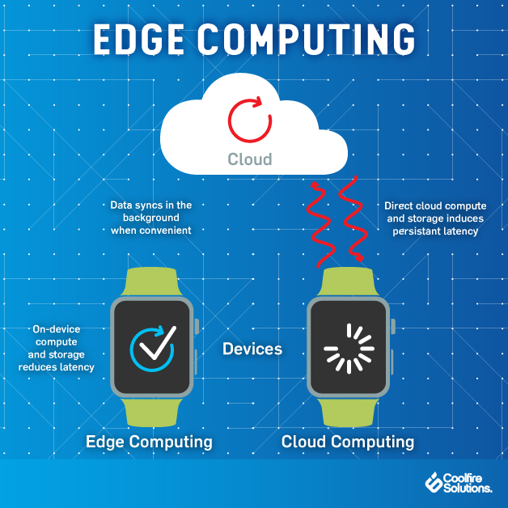
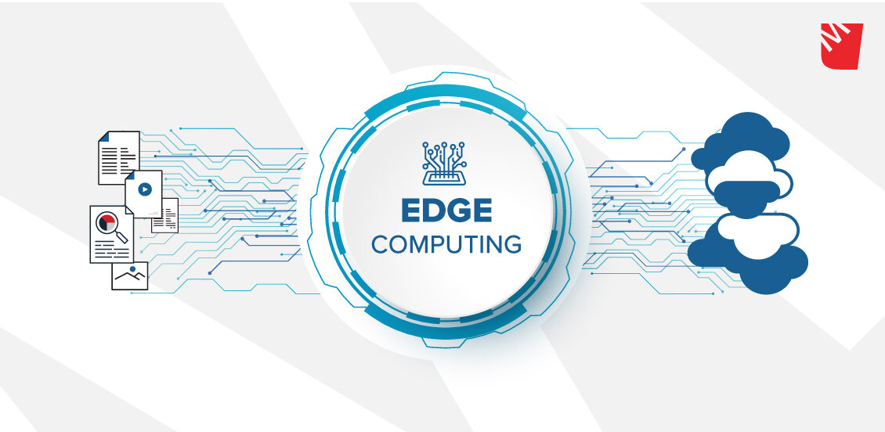
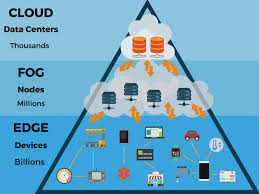

Edge computing is transforming the way data is being handled, processed, and delivered from millions of devices around the world. Gartner defines edge computing as “a part of a distributed computing topology in which information processing is located close to the edge – where things and people produce or consume that information.”

## What is edge computing?

At its basic level, edge computing brings computation and data storage closer to the devices where it’s being gathered, rather than relying on a central location that can be thousands of miles away. This is done so that data, especially real-time data, does not suffer latency issues that can affect an application’s performance. In addition, companies can save money by having the processing done locally, reducing the amount of data that needs to be processed in a centralized or cloud-based location.

Edge computing was developed due to the exponential growth of IoT devices, which connect to the internet for either receiving information from the cloud or delivering data back to the cloud. And many IoT devices generate enormous amounts of data during the course of their operations.

# How Edge Computing Works

In the beginning, there was One Big Computer. Then, in the Unix era, we learned how to connect to that computer using dumb (not a pejorative) terminals.

Next we had personal computers, which was the first time regular people really owned the hardware that did the work.

We’re firmly in the cloud computing era. Many of us still own personal computers, but we mostly use them to access centralized services like Dropbox, Gmail, Office 365, and Slack. Additionally, devices like Amazon Echo, Google Chromecast, and the Apple TV are powered by content and intelligence that’s in the cloud.

## MOST OF THE NEW OPPORTUNITIES FOR THE “CLOUD” LIE AT THE “EDGE”

As centralized as this all sounds, the truly amazing thing about cloud computing is that a seriously large percentage of all companies in the world now rely on the infrastructure, hosting, machine learning, and compute power of a very select few cloud providers: Amazon, Microsoft, Google, and IBM.

Amazon, the largest by far of these “public cloud” providers (as opposed to the “private clouds” that companies like Apple, Facebook, and Dropbox host themselves).

The advent of edge computing as a buzzword you should perhaps pay attention to is the realization by these companies that there isn’t much growth left in the cloud space. Almost everything that can be centralized has been centralized. Most of the new opportunities for the “**cloud**” lie at the “**edge**.”

The word edge in this context means literal geographic distribution. Edge computing is computing that’s done at or near the source of the data, instead of relying on the cloud at one of a dozen data centers to do all the work. It doesn’t mean the cloud will disappear. It means the cloud is coming to you.

Edge computing means running fewer processes in the cloud and moving those processes to local places, such as on a user’s computer, an IoT device or an edge server. Bringing computation to the network’s edge minimizes the amount of long-distance communication that has to happen between a client and server.

## Why does edge computing matter?

The biggest benefit of edge computing is the ability to process and store data faster, enabling for more efficient real-time applications that are critical to companies. Before edge computing, a smartphone scanning a person’s face for facial recognition would need to run the facial recognition algorithm through a cloud-based service, which would take a lot of time to process. With an edge computing model, the algorithm could run locally on an edge server or gateway, or even on the smartphone itself, given the increasing power of smartphones. Applications such as virtual and augmented reality, self-driving cars, smart cities and even building-automation systems require fast processing and response.

Companies such as NVIDIA have recognized the need for more processing at the edge, which is why we’re seeing new system modules that include artificial intelligence functionality built into them. AI algorithms require large amounts of processing power, which is why most of them run via cloud services. The growth of AI chipsets that can handle processing at the edge will allow for better real-time responses within applications that need instant computing.

## LATENCY

One great driver for edge computing is the speed of light. If a Computer A needs to ask Computer B, half a globe away, before it can do anything, the user of Computer A perceives this delay as latency. The brief moments after you click a link before your web browser starts to actually show anything is in large part due to the speed of light. Multiplayer video games implement numerous elaborate techniques to mitigate true and perceived delay between you shooting at someone and you knowing, for certain, that you missed.

EDGE COMPUTING HAS PRIVACY BENEFITS, BUT THEY AREN’T GUARANTEED

Voice assistants typically need to resolve your requests in the cloud, and the roundtrip time can be very noticeable. Your Echo has to process your speech, send a compressed representation of it to the cloud, the cloud has to uncompress that representation and process it — which might involve pinging another API somewhere, maybe to figure out the weather, and adding more speed of light-bound delay — and then the cloud sends your Echo the answer, and finally you can learn that today you should expect a high of 85 and a low of 42, so definitely give up on dressing appropriately for the weather.

So, a recent rumor that Amazon is [working on its own AI chips for Alexa](https://techcrunch.com/2018/02/12/amazon-may-be-developing-ai-chips-for-alexa/) should come as no surprise. The more processing Amazon can do on your local Echo device, the less your Echo has to rely on the cloud. It means you get quicker replies, Amazon’s server costs are less expensive, and conceivably, if enough of the work is done locally you could end up with more privacy — if Amazon is feeling magnanimous.

## BANDWIDTH

Security isn’t the only way that edge computing will help solve the problems IoT introduced. The other hot example I see mentioned a lot by edge proponents is the bandwidth savings enabled by edge computing.

For instance, if you buy one security camera, you can probably stream all of its footage to the cloud. If you buy a dozen security cameras, you have a bandwidth problem. But if the cameras are smart enough to only save the “important” footage and discard the rest, your internet pipes are saved.

Almost any technology that’s applicable to the latency problem is applicable to the bandwidth problem. Running AI on a user’s device instead of all in the cloud seems to be [a huge focus for Apple and Google right now](https://www.theverge.com/2017/10/19/16502538/mobile-ai-chips-apple-google-huawei-qualcomm).

COMPANIES WILL CONTROL EVEN MORE OF YOUR LIFE EXPERIENCES THAN THEY DO RIGHT NOW

But Google is also working hard at making even websites more edge-y. [Progressive Web Apps](https://www.theverge.com/circuitbreaker/2018/4/11/17207964/web-apps-quality-pwa-webassembly-houdini) typically have offline-first functionality. That means you can open a “website” on your phone without an internet connection, do some work, save your changes locally, and only sync up with the cloud when it’s convenient.

Google also is getting smarter at combining local AI features for the purpose of privacy *and*bandwidth savings. For instance, [Google Clips](https://www.theverge.com/2018/2/27/17055618/google-clips-smart-camera-review) keeps all your data local by default and does its magical AI inference locally. It doesn’t work very well at its stated purpose of capturing cool moments from your life. But, conceptually, it’s quintessential edge computing.

## What is an example of edge computing?

Consider a building secured with dozens of high-definition IoT video cameras. These are ‘dumb’ cameras that simply output a raw video signal and continuously stream that signal to a cloud server. On the cloud server, the video output from all the cameras is put through a motion-detection application to ensure that only clips featuring activity are saved to the server’s database. This means there is a constant and significant strain on the building’s Internet infrastructure, as significant bandwidth gets consumed by the high volume of video footage being transferred. Additionally, there is very heavy load on the cloud server that has to process the video footage from all the cameras simultaneously.

Now imagine that the motion sensor computation is moved to the network edge. What if each camera used its own internal computer to run the motion-detecting application and then sent footage to the cloud server as needed? This would result in a significant reduction in bandwidth use, because much of the camera footage will never have to travel to the cloud server.

Additionally, the cloud server would now only be responsible for storing the important footage, meaning that the server could communicate with a higher number of cameras without getting overloaded. This is what edge computing looks like.

## What are other possible use cases for edge computing?

Edge computing can be incorporated into a wide variety of applications, products, and services. A few possibilities include:

- Security system monitoring: As described above.
- IoT devices: Smart devices that connect to the Internet can benefit from running code on the device itself, rather than in the cloud, for more efficient user interactions.
- Self-driving cars: Autonomous vehicles need to react in real time, without waiting for instructions from a server.
- More efficient caching: By running code on a CDN edge network, an application can customize how content is cached to more efficiently serve content to users.
- Medical monitoring devices: It is crucial for medical devices to respond in real time without waiting to hear from a cloud server.
- Video conferencing: Interactive live video takes quite a bit of bandwidth, so moving backend processes closer to the source of the video can decrease lag and latency.
